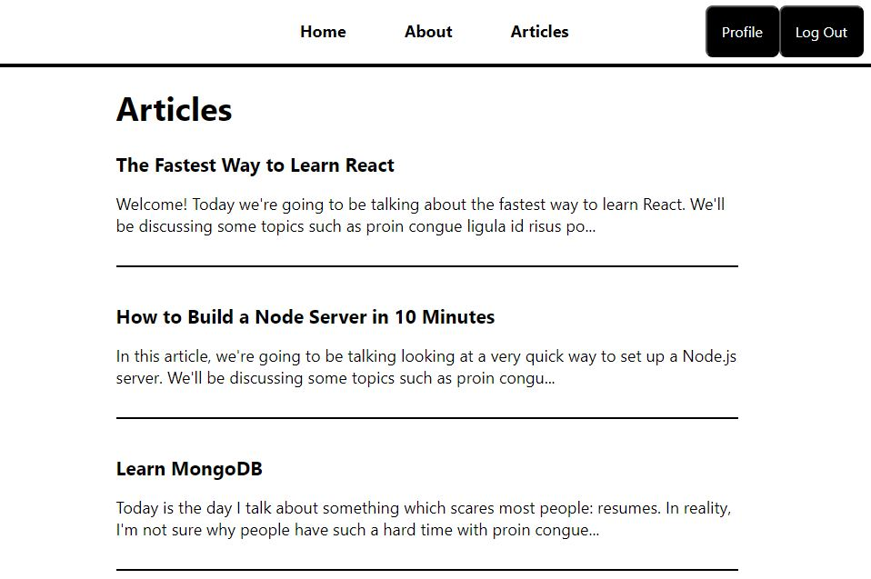
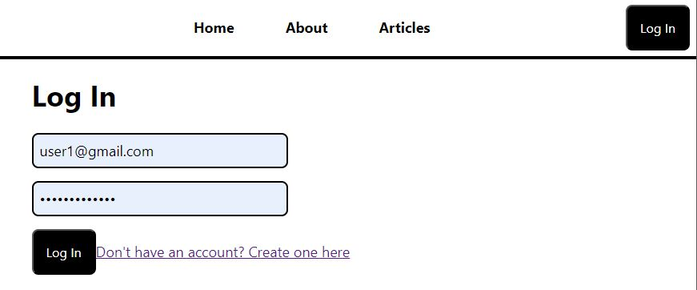
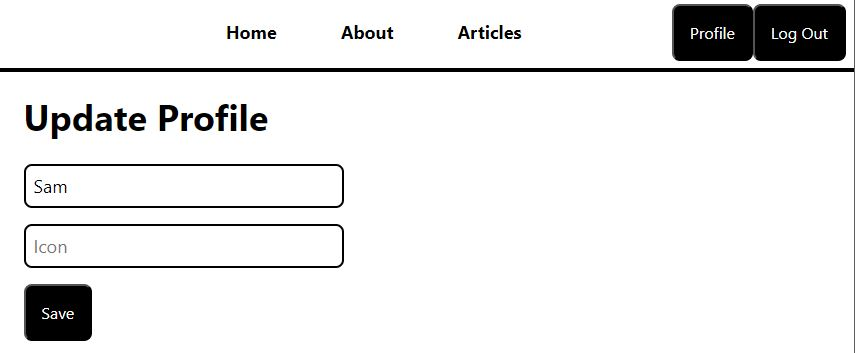
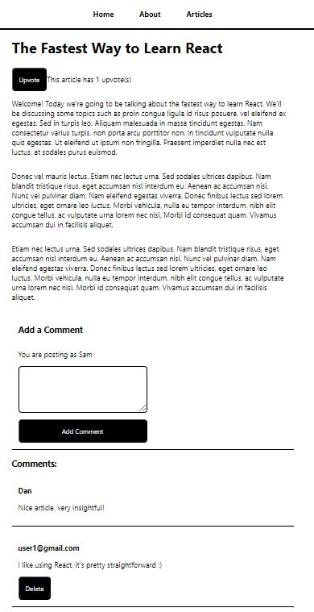

# Blog  
### Overview
This is a blog management application, written using the MERN stack.  
(MERN = MongoDB, Express, React, and Node.js)

# Functionality
Guests can browse articles  
  
Guests can login and register - email is not being validated to make development easier  
  
Users can set up a display name (to be used instead of the email when commenting) and a profile picture  
  
Anyone can read articles, while logged in users can upvote articles(single upvote per user), comment on them and remove their own comments  
  

### Technical Requirements
- Users can login using Firebase Auth
- Logged users can upvote an article, ones
- Logged users can remove their upvote
- Logged users can comment on articles
- Logged in users can edit and delete their comments
- Non logged users can read articles
- Users can update their display name and icon, to be shown in the comments
- Default user icon is provided, if not specified
- When a use updates their profile, updating their icon in all the comments

# Tech
### How to run
Frontend  
``npm start``  
Backend  
``npm run dev``  

#### Frontend  
React  
Packages: axios, firebase  
#### Backend  
Node.js (ES Module Style)  
Packages: express, firebase-admin, dotenv, nodemon 

To build:
rm -r my-blog-backend\build
cd my-blog
npm run build
cp -r .\build\ ..\my-blog-backend\

